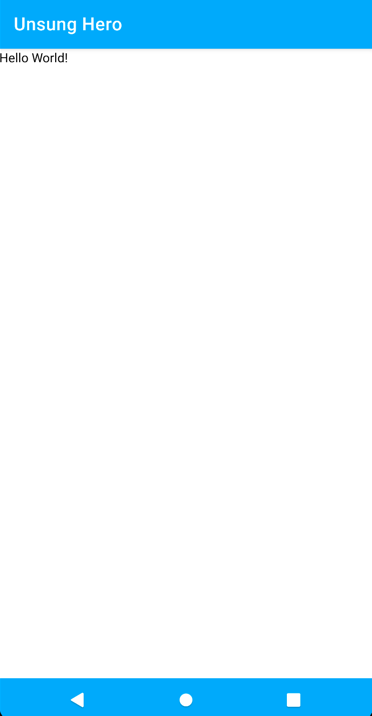

summary: Composifying Unsung Hero App
id: compose-unsung-hero
categories: android
tags: medium
status: Published 
authors: Randal Cunanan
Feedback Link: https://github.com/randalvance/codelab-unsunghero/issues

# Composifying Unsung Hero App
<!-- ------------------------ -->
## Preparations
Duration: 3

Download the Canary Build of Android Studio from the following link:

[https://developer.android.com/studio/preview](https://developer.android.com/studio/preview)

Install Android Studio Canary. Note that this will be a separate app if you already have the regular Android Studio installed.

Open the Unsung Hero android project in Android Studio Canary.

Make sure that we are working on the `develop` branch.


<!-- ------------------------ -->
## Minimum API Level
Duration: 1

Open `build.gradle` for the module

Change the `minSdkVersion` from `16` to `21`
```gradle
defaultConfig {
  applicationId "com.example.unsunghero"
  minSdkVersion 21
  targetSdkVersion 29
  versionCode 1
  versionName "1.0"

  testInstrumentationRunner "androidx.test.runner.AndroidJUnitRunner"
}
```

Sync the project when told so by Android Studio.

<!-- ------------------------ -->
## Setting Up Jetpack Compose
Duration: 3

Note: If you want to skip this, checkout the branch `jetpack-compose-setting-up`.

In your `build.gradle` of the project, add a varible for Jetpack Compose version to use.
```gradle
ext {
  ...
  compose_version = '0.1.0-dev13'
  ...
}
```

Add the following dependencies in your `build.gradle` (module) file.
```gradle
implementation "androidx.ui:ui-layout:$compose_version"
implementation "androidx.ui:ui-material:$compose_version"
implementation "androidx.ui:ui-tooling:$compose_version"
implementation "androidx.ui:ui-livedata:$compose_version"
```

Inside `android` block of you `build.gradle` (module) file, add the following block:
```gradle
  buildFeatures {
      compose true
  }
```

Sync the project when told so by Android Studio.

### Delete Fragment-Related Files

I am receiving an error when building the project, specifically in the code generation phase.
It seems that Fragments and Android Compose does not currently play well together.
Since we are not needing the fragments anymore and will do all the UI via Compose, we can delete the following files:
1. `NominationFragment.kt`
1. `PlaceholderFragment.kt`
1. `SectionsPageAdapter.kt`
1. `FragmentModule`

After the deletion, modify `ApplicationComponent.kt` and remove the line
```kotlin
    FragmentModule::class,
```

In `NominationActivity.kt`, comment out the lines
```kotlin
    binding = DataBindingUtil.setContentView(this, R.layout.activity_nomination)
    binding.viewPager.adapter = SectionsPagerAdapter(this, supportFragmentManager)
    binding.tabs.setupWithViewPager(binding.viewPager)
```

You should now be able to build the project successfully (you may receive some warnings but we can ignore them).


<!-- ------------------------ -->
## Our First Composable
Duration: 5

If you followed along with the previous step and your project can be built without errors, please proceed.
Otherwise, please checkout the branch `jetpack-compose-setting-up` and build the project.

In this step, we will create a simple Composable.

Add a new class named `UnsungHeroApp` inside the `view` package.

```kotlin
package com.zuhlke.unsunghero.view

import androidx.compose.Composable
import androidx.ui.foundation.Text

@Composable
fun UnsungHeroApp() {
    Text("Hello World!")
}
```

In `NominationActivity.kt`, replace the code with the following:
```kotlin
package com.zuhlke.unsunghero.view.nomination

import android.os.Bundle
import androidx.ui.core.setContent
import com.zuhlke.unsunghero.databinding.ActivityNominationBinding
import com.zuhlke.unsunghero.view.UnsungHeroApp
import com.zuhlke.unsunghero.view.commons.BaseActivity

class NominationActivity : BaseActivity() {

    private lateinit var binding: ActivityNominationBinding

    override fun onCreate(savedInstanceState: Bundle?) {
        super.onCreate(savedInstanceState)
        setContent { 
            UnsungHeroApp()
        }
    }
}
```

Build the project and run the app. You should now see the app showing the first composable.



<!-- ------------------------ -->
## Other Stuff
Duration: 1

### Resources
Checkout the official documentation here: [Codelab Formatting Guide](https://github.com/googlecodelabs/tools/blob/master/FORMAT-GUIDE.md)