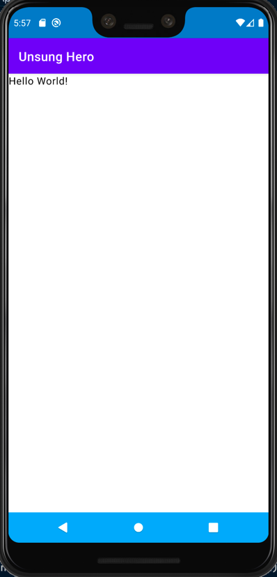
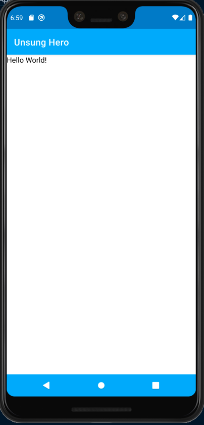
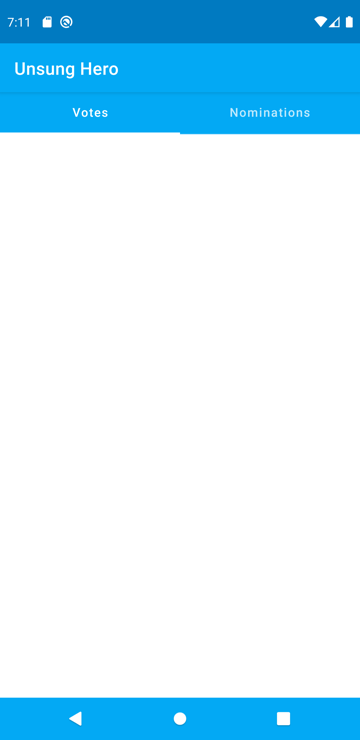
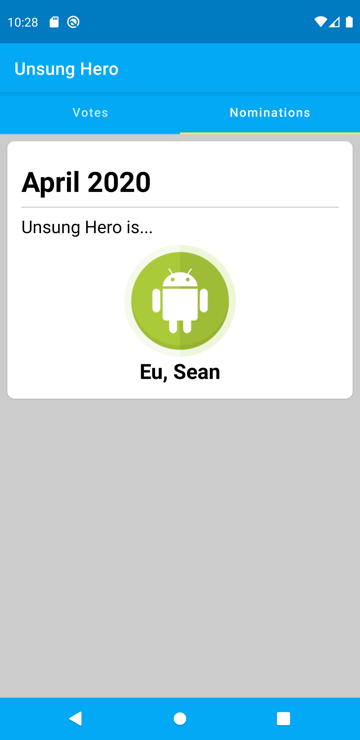
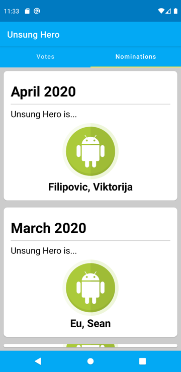

summary: Composifying Unsung Hero App
id: compose-unsung-hero
categories: android
tags: medium
status: Published 
authors: Randal Cunanan
Feedback Link: https://github.com/randalvance/codelab-unsunghero/issues

# Composifying Unsung Hero App
<!-- ------------------------ -->
## Preparations
Duration: 3

Download the Canary Build of Android Studio from the following link:

[https://developer.android.com/studio/preview](https://developer.android.com/studio/preview)

Install Android Studio Canary. Note that this will be a separate app if you already have the regular Android Studio installed.

Open the Unsung Hero android project in Android Studio Canary.

Make sure that we are working on the `develop` branch.


<!-- ------------------------ -->
## Minimum API Level
Duration: 1

Open `build.gradle` for the module

Change the `minSdkVersion` from `16` to `21`
```gradle
defaultConfig {
  applicationId "com.example.unsunghero"
  minSdkVersion 21
  targetSdkVersion 29
  versionCode 1
  versionName "1.0"

  testInstrumentationRunner "androidx.test.runner.AndroidJUnitRunner"
}
```

Sync the project when told so by Android Studio.

<!-- ------------------------ -->
## Setting Up Jetpack Compose
Duration: 3

Note: If you want to skip this, checkout the branch `jetpack-compose-setting-up`.

In your `build.gradle` of the project, add a varible for Jetpack Compose version to use.
```gradle
ext {
  ...
  compose_version = '0.1.0-dev13'
  ...
}
```

Add the following dependencies in your `build.gradle` (module) file.
```gradle
implementation "androidx.ui:ui-layout:$compose_version"
implementation "androidx.ui:ui-material:$compose_version"
implementation "androidx.ui:ui-tooling:$compose_version"
implementation "androidx.ui:ui-livedata:$compose_version"
```

Inside `android` block of you `build.gradle` (module) file, add the following block:
```gradle
  buildFeatures {
      compose true
  }
```

Sync the project when told so by Android Studio.

### Delete Fragment-Related Files

I am receiving an error when building the project, specifically in the code generation phase.
It seems that Fragments and Android Compose does not currently play well together.
Since we are not needing the fragments anymore and will do all the UI via Compose, we can delete the following files:
1. `NominationFragment.kt`
1. `PlaceholderFragment.kt`
1. `SectionsPageAdapter.kt`
1. `FragmentModule`

After the deletion, modify `ApplicationComponent.kt` and remove the line
```kotlin
    FragmentModule::class,
```

In `NominationActivity.kt`, comment out the lines
```kotlin
    binding = DataBindingUtil.setContentView(this, R.layout.activity_nomination)
    binding.viewPager.adapter = SectionsPagerAdapter(this, supportFragmentManager)
    binding.tabs.setupWithViewPager(binding.viewPager)
```

You should now be able to build the project successfully (you may receive some warnings but we can ignore them).


<!-- ------------------------ -->
## Our First Composable
Duration: 5

If you followed along with the previous step and your project can be built without errors, please proceed.
Otherwise, please checkout the branch `jetpack-compose-setting-up` and build the project.

In this step, we will create a simple Composable.

Add a new class named `UnsungHeroApp` inside the `view` package.

```kotlin
package com.zuhlke.unsunghero.view

import androidx.compose.Composable
import androidx.ui.foundation.Text

@Composable
fun UnsungHeroApp() {
    Text("Hello World!")
}
```

In `NominationActivity.kt`, replace the code with the following:
```kotlin
package com.zuhlke.unsunghero.view.nomination

import android.os.Bundle
import androidx.ui.core.setContent
import com.zuhlke.unsunghero.databinding.ActivityNominationBinding
import com.zuhlke.unsunghero.view.UnsungHeroApp
import com.zuhlke.unsunghero.view.commons.BaseActivity

class NominationActivity : BaseActivity() {

    private lateinit var binding: ActivityNominationBinding

    override fun onCreate(savedInstanceState: Bundle?) {
        super.onCreate(savedInstanceState)
        setContent { 
            UnsungHeroApp()
        }
    }
}
```

Build the project and run the app. You should now see the app showing the first composable.


<!-- ------------------------ -->
## Preview Feature
Duration: 3

We can preview the composed UI by creating a dummy composable annotated with `@Preview` annotation.
In the file `UnsungHeroApp.kt` where we defined the `UnsungHeroApp` composable, add another composable:

```kotlin

import androidx.ui.tooling.preview.Preview
...

@Preview
@Composable
fun UnsungHeroAppPreview() {
    UnsungHeroApp()
}
```
The moment you add it, a preview of the UI will be shown to you. Be sure that the editor is set to Split mode.
Before you can preview it, you need to build the project first.

Note that if the preview still doesn't show, try closing and reopening the file (remember, we are working on a developer preview version).

<!-- ------------------------ -->
## Material Theme
Duration: 3

Let's begin building the actual UI for Unsung Hero app.
The first thing we need to add is a Tabs Control with 2 tabs, Votes and Nominations.

Fortunately, Jetpack Compose provides some composables out of the box.
These composables are packaged in `androidx.ui.material` which we already included in our gradle file.

For a full list of available material composables we can use, refer to the following link:
[https://developer.android.com/reference/kotlin/androidx/ui/material/package-summary](https://developer.android.com/reference/kotlin/androidx/ui/material/package-summary)

Looking at the list of composables in the documentation above, we can use a `TabRow` to display tabs.
However, when using any material composable, we need to wrap the composables inside the `MaterialTheme` composable.

Wrap the contents of `UnsungHeroApp` with `MaterialTheme` composable.
```kotlin
import androidx.ui.material.*
...

@Composable
fun UnsungHeroApp() {
    MaterialTheme() {
        Text("Hello World!")
    }
}
```

Note that I imported `import androidx.ui.material.*` so we can use all material composables without importing them one by one.

<!-- ------------------------ -->
## Creating the Scaffold
Duration: 3

Modify the code to add the `Scaffold` composable.
```kotlin
@Composable
fun UnsungHeroApp() {
    MaterialTheme() {
        Scaffold(
            topAppBar = {
                TopAppBar(
                    title = { Text(text = "Unsung Hero") }
                )
            },
            bodyContent = {
                Text("Hello World!")
            }
        )
    }
}
```
If you run the app, you will notice that we now have 2 app bars which look weird.
Go to the android manifest and change the theme to `AppTheme.NoActionBar`
```xml
<application
    ...
    android:theme="@style/AppTheme.NoActionBar"
    ...
    >
    ...
</application>
```
Our app should now look like the following when you run it.



Don't worry about the color mismatch, we will fix that next.

<!-- ------------------------ -->
## Applying the Theme
Duration: 3

We will seperate any theming logic in another composable.
Under the `view` package, create a new file `AppTheme.kt`.

```kotlin
package com.zuhlke.unsunghero.view

import androidx.compose.Composable
import androidx.ui.foundation.shape.corner.RoundedCornerShape
import androidx.ui.graphics.Color
import androidx.ui.material.*
import androidx.ui.text.TextStyle
import androidx.ui.text.font.FontFamily
import androidx.ui.text.font.FontWeight
import androidx.ui.unit.sp
import androidx.ui.unit.dp

private val LightColorPalette = lightColorPalette(
    primary = Color(0xFF03A9F4),
    primaryVariant = Color(0xFF67DAFF),
    secondary = Color(0xFFFFEB3B)
)

val shapes = Shapes(
    small = RoundedCornerShape(4.dp),
    medium = RoundedCornerShape(4.dp),
    large = RoundedCornerShape(0.dp)
)

val typography = Typography(
    body1 = TextStyle(
        fontFamily = FontFamily.Default,
        fontWeight = FontWeight.Normal,
        fontSize = 16.sp
    )
)

@Composable
fun AppTheme(content: @Composable() () -> Unit) {
    MaterialTheme(
        colors = LightColorPalette,
        typography = typography,
        shapes = shapes,
        content = content
    )
}
```
Back to the `UnsungHeroApp` composable, replace `MaterialTheme` with the `AppTheme` we just created.
```kotlin
@Composable
fun UnsungHeroApp() {
    AppTheme {
        Scaffold(
            topAppBar = {
                TopAppBar(
                    title = { Text(text = "Unsung Hero") }
                )
            },
            bodyContent = {
                Text("Hello World!")
            }
        )
    }
}
```
It should now look like the following:



<!-- ------------------------ -->
## Adding the TabRow
Duration: 3

Let's go back to `UnsungHeroApp.kt`. Inside this file, we can add an enum for the Sections/Tabs.
```kotlin
private enum class Sections(val title: String) {
    Votes("Votes"),
    Nominations("Nominations")
}
```
We will add the `TabRow` composable inside the body property of the `Scaffold`.

```kotlin

@Composable
fun UnsungHeroApp() {
    AppTheme {
        Scaffold(
            topAppBar = {
                TopAppBar(
                    title = { Text(text = "Unsung Hero") }
                )
            },
            bodyContent = {
                val (currentSection, setCurrentSection) = state { Sections.Votes }
                val sectionTitles = Sections.values().map { it.title }

                TabRow(
                    items = sectionTitles,
                    selectedIndex = currentSection.ordinal
                ) { index, title ->
                    Tab(
                        text = { Text(title) },
                        selected = currentSection.ordinal == index,
                        onSelected = {
                            setCurrentSection(Sections.values()[index])
                        }
                    )
                }
            }
        )
    }
}
```
It should now look like the following:



### Changing the Tab Indicator Color

Currently, the indicator of the TabRow is not using the accent color.
As of this writing, there is no property to set it directly.
Fortunately, we can pass a composable that we can customize however we want.
Modify the code to pass a composable function to `indicatorContainer`.

```kotlin
TabRow(
    items = sectionTitles,
    selectedIndex = currentSection.ordinal,
    indicatorContainer = { tabPositions ->
        TabRow.IndicatorContainer(tabPositions, currentSection.ordinal) {
            TabRow.Indicator(
                color = MaterialTheme.colors.secondary
            )
        }
    }
)
```
We provided a color from `MaterialTheme.colors` and the `secondary` color corresponds to the accent color.
Run the app and the indicator should now be using the secondary color.

<!-- ------------------------ -->
## Refactor UnsungHeroApp Composable
Duration: 3

The code for the `UnsungHeroApp` composable is starting to get unmanageable.
Composable codes are written in pure Kotlin, so we can use the built-in Kotlin tooling of Android Studio to do some refactoring.

Highlight the entire content of the `Scaffold`'s body (the value assigned for the `bodyContent` starting from `{` to `}`).
Right-click, choose Refactor, then Function....

A dialog will be shown where you can specify the function name.
Name it `BodyContent` and click OK.
The code should now look like this:

```kotlin
@Composable
fun UnsungHeroApp() {
    AppTheme {
        Scaffold(
            topAppBar = {
                TopAppBar(
                    title = { Text(text = "Unsung Hero") }
                )
            },
            bodyContent = {
                BodyContent()
            }
        )
    }
}

@Composable
private fun BodyContent() {
    val (currentSection, setCurrentSection) = state { Sections.Votes }
    val sectionTitles = Sections.values().map { it.title }

    TabRow(
        items = sectionTitles,
        selectedIndex = currentSection.ordinal,
        indicatorContainer = { tabPositions ->
            TabRow.IndicatorContainer(tabPositions, currentSection.ordinal) {
                TabRow.Indicator(
                    color = MaterialTheme.colors.secondary
                )
            }
        }
    ) { index, title ->
        Tab(
            text = { Text(title) },
            selected = currentSection.ordinal == index,
            onSelected = {
                setCurrentSection(Sections.values()[index])
            }
        )
    }
}
```

The `UnsungHeroApp` is now much smaller and easier to read.

<!-- ------------------------ -->
## Add the Sections
Duration: 2

We will create placeholder sections for the Votes section and the Nominations section.

Under `view` package, add 2 new files, `VotesSection.kt` and `NominationsSection.kt`.
They both define new a new composable. We can provide a simple `Text` composable as content for now.

**VotesSection.kt**
```kotlin
package com.zuhlke.unsunghero.view

import androidx.compose.Composable
import androidx.ui.foundation.Text

@Composable
fun VotesSection() {
    Text("Votes Section")
}
```
**NominationsSection.kt**
```kotlin
package com.zuhlke.unsunghero.view

import androidx.compose.Composable
import androidx.ui.foundation.Text

@Composable
fun NominationsSection() {
    Text("Nominations Section")
}
```

In `UnsungHeroApp.kt`, wrap the `TabRow` composable with a `Column` composable.
```kotlin
Column {
    TabRow(
        ...
    ) { index, title ->
        ...
    }
}
```
Right after the closing `}` of `TabRow`, add the following code:
```kotlin
Box {
    when (currentSection) {
        Sections.Votes -> {
            VotesSection()
        }
        Sections.Nominations -> {
            NominationsSection()
        }
    }
}
```
Run the app and observe that the correct section is shown when you click a tab.

<!-- ------------------------ -->
## Nomination Card Component
Duration: 5

Let's build a card component that will hold a nomination entry.
Under `view` package, create a new file named `NotificationCard.kt`.

```kotlin
package com.zuhlke.unsunghero.view

import androidx.compose.Composable
import androidx.ui.core.Alignment
import androidx.ui.core.Modifier
import androidx.ui.foundation.*
import androidx.ui.foundation.shape.corner.RoundedCornerShape
import androidx.ui.graphics.Color
import androidx.ui.layout.*
import androidx.ui.material.*
import androidx.ui.res.imageResource
import androidx.ui.unit.dp

import com.zuhlke.unsunghero.R

@Composable
fun NominationCard() {
    Card(
        modifier = Modifier
            .fillMaxWidth()
            .padding(8.dp),
        shape = MaterialTheme.shapes.medium
    ) {
        Column(
            modifier = Modifier.padding(16.dp)
        )  {
            Text(
                text = "April 2020",
                style = MaterialTheme.typography.h1,
                modifier = Modifier.padding(0.dp, 8.dp)
            )
            Divider(
                thickness = 1.dp,
                color = Color(0xFFCCCCCC)
            )
            Text(
                text = "Unsung Hero is...",
                style = MaterialTheme.typography.body1,
                modifier = Modifier.padding(0.dp, 8.dp)
            )
            Image(
                modifier = Modifier
                    .size(128.dp)
                    .gravity(Alignment.CenterHorizontally),
                asset = imageResource(R.drawable.profile_image)
            )
            Text(
                text = "Eu, Sean",
                style = MaterialTheme.typography.h2,
                modifier = Modifier.gravity(Alignment.CenterHorizontally)
            )
        }
    }
}
```
We need to define and update the typography in `AppTheme.kt`.
```kotlin
val typography = Typography(
    h1 = TextStyle(
        fontFamily = FontFamily.Default,
        fontWeight = FontWeight.Bold,
        fontSize = 32.sp
    ),
    h2 = TextStyle(
        fontFamily = FontFamily.Default,
        fontWeight = FontWeight.Bold,
        fontSize = 24.sp
    ),
    body1 = TextStyle(
        fontFamily = FontFamily.Default,
        fontWeight = FontWeight.Normal,
        fontSize = 20.sp
    )
)
```
In the `LightColorPalette`, set a color to the `background`.
```kotlin
private val LightColorPalette = lightColorPalette(
    primary = Color(0xFF03A9F4),
    primaryVariant = Color(0xFF67DAFF),
    secondary = Color(0xFFFFEB3B),
    background = Color(0xFFCCCCCC)
)
```
Also update the shape values.
```kotlin
val shapes = Shapes(
    small = RoundedCornerShape(4.dp),
    medium = RoundedCornerShape(8.dp),
    large = RoundedCornerShape(12.dp)
)
```
Go to `NominationsSection.kt` and add the new `NominationCard` composable.
```kotlin
@Composable
fun NominationsSection() {
    NominationCard()
}
```
When you run the app and go to the Nominations Tab, you should now see this:



<!-- ------------------------ -->
## Nomination Card - Passing Arguments
Duration: 3

The `NominationCard` composable currently use hardcoded values.
This values can be provided instead by the parent who will use this composable.
It is easy to define this properties as a composable is really just a function, so we can define some parameters to the function.
Modify `NominationCard` composable to use the following code.

```kotlin
@Composable
fun NominationCard(
    nominationDate: Date,
    winner: String
) {
    Card(
        modifier = Modifier
            .fillMaxWidth()
            .padding(8.dp),
        shape = MaterialTheme.shapes.medium
    ) {
        val dateFormat = SimpleDateFormat("MMMM yyyy", Locale.US)
        val nominationDateFormatted = dateFormat.format(nominationDate)
        
        Column(
            modifier = Modifier.padding(16.dp)
        )  {
            Text(
                text = nominationDateFormatted,
                style = MaterialTheme.typography.h1,
                modifier = Modifier.padding(0.dp, 8.dp)
            )
            Divider(
                thickness = 1.dp,
                color = Color(0xFFCCCCCC)
            )
            Text(
                text = "Unsung Hero is...",
                style = MaterialTheme.typography.body1,
                modifier = Modifier.padding(0.dp, 8.dp)
            )
            Image(
                modifier = Modifier
                    .size(128.dp)
                    .gravity(Alignment.CenterHorizontally),
                asset = imageResource(R.drawable.profile_image)
            )
            Text(
                text = winner,
                style = MaterialTheme.typography.h2,
                modifier = Modifier.gravity(Alignment.CenterHorizontally)
            )
        }
    }
}
```
Modify `NominationsSection` to pass dummy arguments to `NotificationCard`.
```kotlin
@Composable
fun NominationsSection() {
    NominationCard(
        nominationDate = Date(),
        winner = "Goh, Clare"
    )
}
```
Run the app, and you should see that it now takes the parameter values.

<!-- ------------------------ -->
## Loading Nominations from Backend
Duration: 5

We have arrive at the part were we can finally load data from the backend API.
Unsung Hero at it's current state, is already able to do that by using the `NominationsViewModel.pastNominations` live data.

We can simply use this same live data thanks to live data integration support introduced by the recent release of `0.1.0-dev13`.

But first, we need to have access to the `NominationsViewModel`.

Open `NominationActivity` and add a new field to load the view model.
```kotlin
private val viewModel by viewModels<NominationViewModel> { viewModelFactory }
```

We now need to pass this view model from the top `UnsungHeroApp` composable, up to the inner `NominationSection` composable which will use it.

First, let's pass the viewModel to the `UnsungHeroApp`.
```kotlin
UnsungHeroApp(viewModel)
```

Open `UnsungHeroApp.kt` and modify the function signature of the composable to accept `NominationViewModel`.
```kotlin
fun UnsungHeroApp(viewModel: NominationViewModel) {
```

Pass the viewModel to the `BodyContent`
```kotlin
BodyContent(viewModel)
```

Modify `BodyContent` composable so it accepts `NominationViewModel`.
```kotlin
private fun BodyContent(viewModel: NominationViewModel) {
```

Pass the viewModel to the `NominationsSection`
```kotlin
NominationsSection(viewModel)
```

Modify `NominationsSection` composable so it accepts `NominationViewModel`.
```kotlin
fun NominationsSection(viewModel: NominationViewModel) {
```

Finally! We have access to the viewModel within the `NominationsSection` composable.

We can subscribe to the `pastNominations` observable of the `NominationViewModel` inside `NominationsSection` by adding the following line of code as the first line in the body of the `NominationsSection` composable.
```kotlin
val pastNominations = viewModel.pastNominations.observeAsState()
```
You need to import `import androidx.ui.livedata.observeAsState`.

To test this out, after the line we just wrote, add a `Text` composable and let's print out the `size` property of the nominations list returned by the API.

```kotlin
Text(pastNominations.value?.size.toString())
```

When you run the app, you will notice that `null` is displayed, but we expect it to be a number.

We will see how to fix this next.

<!-- ------------------------ -->
## Composable Effects
Duration: 3

Composable have "effects", as they are called in other frameworks.
Think of this as lifecycle hooks.

The 3 important ones are:
1. `onActive` - Executes once after the Composable is created
1. `onDispose` - Executes when the Composable is destroyed
1. `onCommit` - Executes when the parameters of the composable was changed

Given this knowledge, we can invoke the loading of nominations when the `NominationsSection` was created (ie. when it becomes the active Section being viewed).

In `NominationsSection` composable, add the following block anywhere inside the composable's body.
```kotlin
onActive {
    viewModel.fetchPastNominations()
}
```

Run the app and navigate to the Nominations section.
Observe the text value that should output the count of nominations.
After a few seconds, it should now change to the actual count of fetched nominations.

<!-- ------------------------ -->
## Displaying the Past Nominations
Duration: 3

Now that we can load the nominations, let's actually display them!

In `NominationsSection`, delete 
```kotlin
Text(pastNominations.value?.size.toString())
```

Change the call to `NominationCard` composable to:
```kotlin
val pastNominationsVal = pastNominations.value;
if (pastNominationsVal != null) {
    for (nomination in pastNominationsVal) {
        NominationCard(
            nominationDate = nomination.start,
            winner = nomination.winner?.name ?: "Unknown"
        )
    }
} else {
    Text("Loading...")
}
```
Run the app and navigate to Nominations Section. You can now see the nominations.



However, we cannot scroll it currently. Let's see how we can do that next.

<!-- ------------------------ -->
## Creating the Nominations List
Duration: 3

Inside `NominationsSection` composable, highlight the for loop that displays the nominations card.
Do the same steps to refactor them to a separate composable.

```kotlin
@Composable
private fun NotificationsList(pastNominationsVal: List<NominationResponse>) {
    for (nomination in pastNominations) {
        NominationCard(
            nominationDate = nomination.start,
            winner = nomination.winner?.name ?: "Unknown"
        )
    }
}
```
Change the code to use the `AdapterList` composable from `import androidx.ui.foundation`.

```kotlin
@Composable
private fun NotificationsList(pastNominations: List<NominationResponse>) {
    AdapterList(data = pastNominations) {
        NominationCard(
            nominationDate = it.start,
            winner = it.winner?.name ?: "Unknown"
        )
    }
}
```

Run the app and navigate to Nominations Section. You can now scroll the nominations!

<!-- ------------------------ -->
## CodeLab Complete
Duration: 1

Thank you for completing this code lab.

The final code was pushed to `jetpack-compose-final` branch.

Enjoy!!